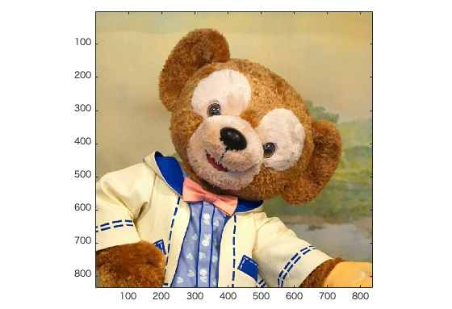
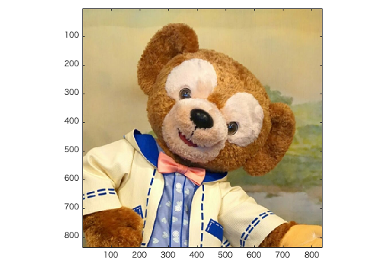
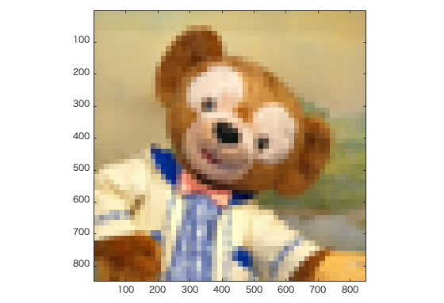
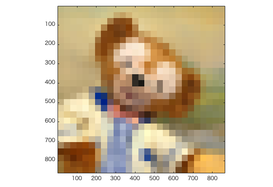

#課題1レポート

画像「duffy」を原画像とする。 
この画像は縦835画素、横835画素による正方形のディジタルカラー画像である。

ORG=imread('duffy.jpg'); % 原画像の入力 
imagesc(ORG); axis image; % 画像の表示

によって、原画像を読み込み、表示した結果を図1に示す。 
 
図1 原画像

原画像を1/2サンプリングするには、画像を1/2倍に縮小した後、2倍に拡大すればよい。 
なお、拡大する際には、単純補間するために「box」オプションを設定する。 

IMG = imresize(ORG,0.5); % 画像の縮小 
IMG2 = imresize(IMG,2,'box'); % 画像の拡大 

1/2サンプリングの結果を図2に示す。 
 
図2 1/2サンプリング  

同様に、原画像を1/4サンプリングするには、画像をさらに1/2倍に縮小した後、4倍に拡大すればよい。 

IMG = imresize(IMG,0.5); % 画像の縮小 
IMG2 = imresize(IMG,4,'box'); % 画像の拡大 

1/4サンプリングの結果を図3に示す。 

 

図3 1/4サンプリング 

1/8から1/32サンプリングは、 

IMG = imresize(IMG,0.5); % 画像の縮小 
IMG2 = imresize(IMG,8,'box'); % 画像の拡大 

を繰り返す。画像の拡大の部分は16および32に変更する。 
サンプリングの結果を図4~6に示す。 
 
図4 1/8サンプリング 
 
図5 1/16サンプリング 
 
図6 1/32サンプリング 