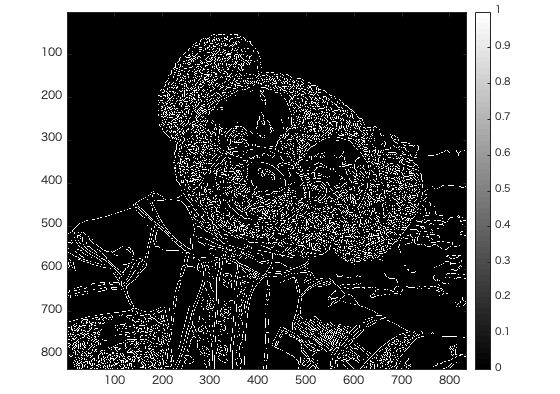

# 課題10レポート

画像「duffy」を原画像とする。この画像は縦835画素、横835画素による正方形のディジタルカラー画像である。  

ORG = imread('duffy.jpg'); % 原画像の入力  
ORG = rgb2gray(ORG); %カラーからグレイへの変換  

によって、原画像を読み込み、カラー画像をグレースケール画像へ変換し、表示した結果を図1に示す。  

  
図1 変換した原画像  

IMG = edge(ORG,'prewitt'); % エッジ抽出（プレウィット法）

により、図1の画像をプレウィット方によりエッジ抽出したものを図2に示す。

  
図2 プレウィット法によるエッジ抽出  

また、  
IMG = edge(ORG,'sobel'); % エッジ抽出（ソベル法）

により、図1の画像をソベル方によりエッジ抽出したものを図3に示す。

  
図3 ソベル法によるエッジ抽出  

また、  
IMG = edge(ORG,'canny'); % エッジ抽出（キャニー法）

により、図1の画像をキャニー法によりエッジ抽出したものを図4に示す。

  
図3 キャニー法によるエッジ抽出  
