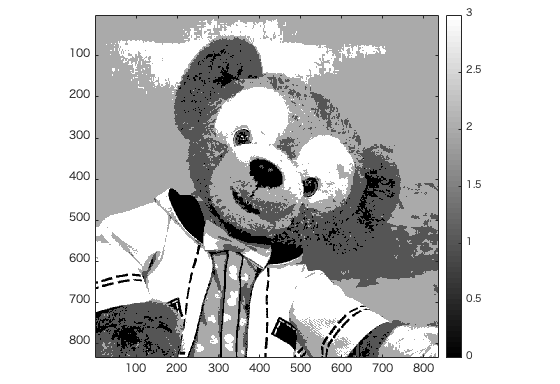
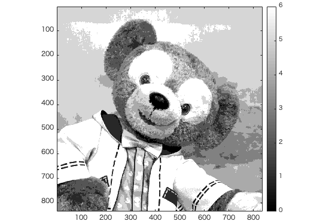

# 課題2レポート

画像「duffy」を原画像とする。この画像は縦835画素、横835画素による正方形のディジタルカラー画像である。

ORG=imread('duffy.jpg'); % 原画像の入力  
ORG = rgb2gray(ORG); colormap(gray); colorbar;  

によって、原画像を読み込み、白黒濃淡画像に変換し、表示した結果を図1に示す。  
  
図1 変換した原画像  

2階調画像を生成するには、0~255の中間である128をしきい値として、画像を白黒で表示すればよい。

IMG = ORG>128  

によって、2階調画像を生成した結果を図2に示す。
  
図2 2階調画像

同様に、4階調にするには、64,128,192の3つの値ををしきい値とすればよい。

IMG0 = ORG>64;  
IMG1 = ORG>128;  
IMG2 = ORG>192;  
IMG = IMG0 + IMG1 + IMG2;  

によって、4階調画像を生成した結果を図3に示す。  

  
図3 4階調画像  

また、8階調画像は、32,64,96,128,160,192,324の7つの値ををしきい値とすればよい。

IMG0 = ORG>32;  
IMG1 = ORG>64;  
IMG2 = ORG>96;  
IMG3 = ORG>128;  
IMG4 = ORG>160;  
IMG5 = ORG>192;  
IMG6 = ORG>324;  
IMG = IMG0 + IMG1 + IMG2 + IMG3 + IMG4 + IMG5 + IMG6;  

により、8階調画像を生成した結果結果を図4に示す。

  
図4 8階調画像
