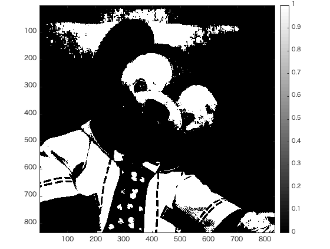

# 課題3レポート

画像「duffy」を原画像とする。この画像は縦835画素、横835画素による正方形のディジタルカラー画像である。

ORG=imread('duffy.jpg'); % 原画像の入力  
ORG= rgb2gray(ORG); % カラー画像を白黒濃淡画像へ変換  

によって、原画像を読み込み、カラー画像を白黒濃淡画像へ変換し、表示した結果を図1に示す。

  
図1 変換した原画像

原画像を輝度値が32以上の画素を1、その他を0に変換した画像、すなわち、しきい値を32にする。  

IMG = ORG > 32;  

変換した結果を図2に示す。  
  
図2 しきい値32

同様に、しきい値を96,160,192として原画像を変換した画像を図3〜5に示す。

  
図3 しきい値96  

  
図4 しきい値160

  
図5 しきい値192
