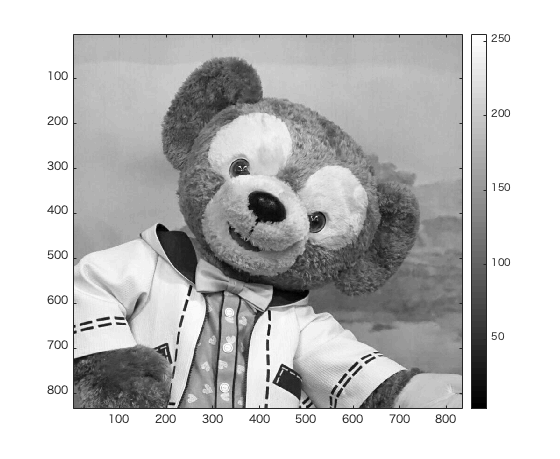
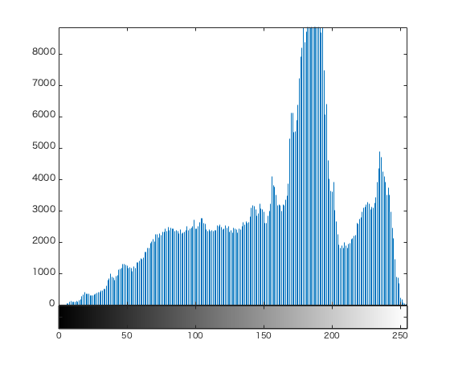

# 課題4レポート

画像「duffy」を原画像とする。この画像は縦835画素、横835画素による正方形のディジタルカラー画像である。

ORG=imread('duffy.jpg'); % 原画像の入力  
ORG=rgb2gray(ORG); % カラー画像を白黒濃淡画像へ変換  

によって、原画像を読み込み、カラー画像を白黒濃淡画像へ変換し、表示した結果を図1に示す。  

  
図1 変換した原画像  

imhist(ORG); % ヒストグラムの表示  

により作成した、原画像のヒストグラムを図2に示す。

  
図2 ヒストグラム

図1と図2より、ヒストグラムの150~200間の大きくなっている部分は、背景の画素を示すことが予想される。また、250付近の山は、顔の暗い部分だろう。
