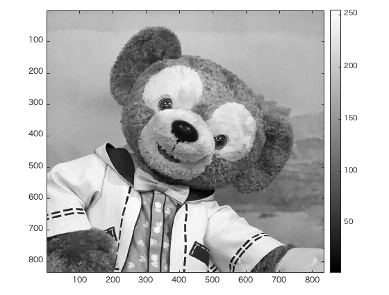
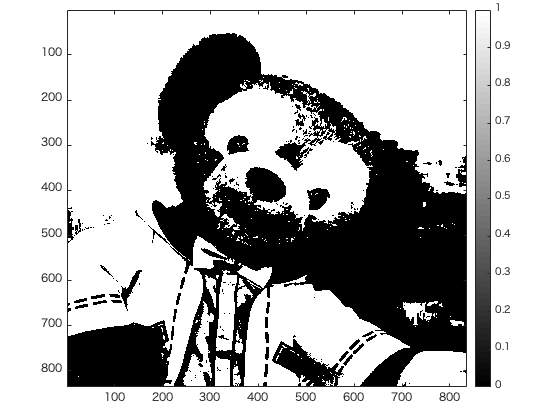

#課題5レポート

画像「duffy」を原画像とする。この画像は縦835画素、横835画素による正方形のディジタルカラー画像である。

ORG=imread('duffy.jpg'); % 原画像の入力  
ORG = rgb2gray(ORG); % カラー画像を白黒濃淡画像へ変換  

によって、原画像を読み込み、カラー画像を白黒濃淡画像へ変換し、表示した結果を図1に示す。  

  
図1 変換した原画像  

H = imhist(ORG); %ヒストグラムのデータを列ベクトルHに格納  

によって、原画像のヒストグラムのデータ列をベクトルHに格納する。  
iが0〜256の間で、  

1. C1 = H(1:i); %ヒストグラムを2つのクラスに分ける  
	C2 = H(i+1:256);
	
	によって、ヒストグラムを2つのクラスに分ける。

2. n1 = sum(C1); %画素数の算出  
	n2 = sum(C2);  
	myu1 = mean(C1); %平均値の算出  
	myu2 = mean(C2);   
	sigma1 = var(C1); %分散の算出  
	sigma2 = var(C2);  
	
	によって、各クラスの画素数、平均値、分散を算出する。

3. sigma\_w = (n1 * sigma1+n2 * sigma2)/(n1+n2); %クラス内分散の算出  
	sigma\_B = (n1 * (myu1-myu\_T)^2+n2 * (myu2-myu\_T)^2)/(n1+n2); 
%クラス間分散の算出  

	によって、2で求めた値を使い、クラス内分散とクラス間分散を求める。

4. if max\_val<sigma\_B/sigma\_w  
	max\_val = sigma\_B/sigma\_w;  
	max\_thres =i;  
	
	によって、3で求めた値を使い、(クラス間分散)/(クラス内分散)を	求め、max\_valよりも値が大きければ、その値で更新する。  
	また、その時のiの値をmax\_thresとする。

以上の1〜4を繰り返す。  
最後に、

IMG = ORG > max_thres;  

によって、(クラス間分散)/(クラス内分散)が最大だった時の値をしきい値として、原画像を2値画像に変換する。  

上記のプログラムを実行した結果、図2の2値画像と、下記の値が得られた。  

 
図2 2値画像  

表1 得られた変数の値  

|変数名|値|
|:--------:|:------:|
|max\_thres|156|
|max\_val|0.3471|

表1より、図2の画像は輝度値156をしきい値として得られた2値画像であることがわかる。