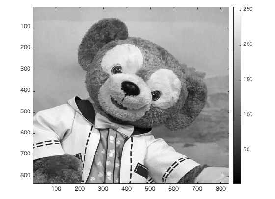
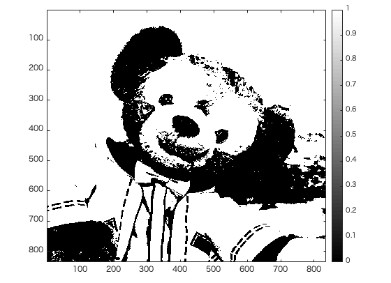
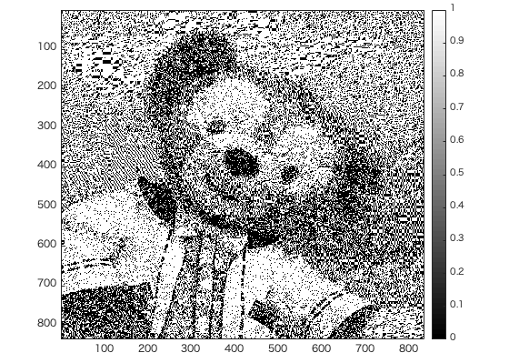

#課題6レポート

画像「duffy」を原画像とする。この画像は縦835画素、横835画素による正方形のディジタルカラー画像である。  

ORG=imread('duffy.jpg'); % 原画像の入力  
ORG=rgb2gray(ORG);  

によって、原画像を読み込み、カラー画像を白黒濃淡画像へ変換し、表示した結果を図1に示す。  

  
図1 変換した原画像  

IMG = ORG>128; % 128による二値化  

により、しきい値を128として原画像を2値画像に変換したものを図2に示す。  

 
図2 128による2値化

また、
IMG = dither(ORG); % ディザ法による二値化  

により、ディザ法を用いて原画像を2値画像に変換したものを図3に示す。

  
図3 ディザ法による二値化  

図2と図３を比較すると、ディザ法を用いて変換した図3の方がより多くの階調を表現できていることがわかる。
