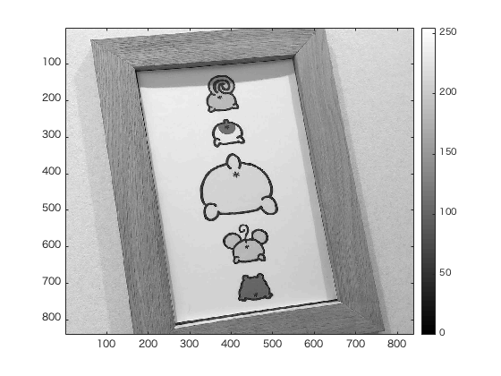

#課題7レポート

画像「pompom」を原画像とする。この画像は縦840画素、横840画素による正方形のディジタルカラー画像である。  

ORG = imread('pompom.jpg'); % 画像の読み込み  
ORG = rgb2gray(ORG); % 白黒濃淡画像に変換  

によって、原画像を読み込み、カラー画像を白黒濃淡画像へ変換し、表示した結果を図1に示す。  

  
図1 変換した原画像  

また、

imhist(ORG); % 濃度ヒストグラムを生成、表示

により、原画像の濃度ヒストグラムを表示させた。表示されたヒストグラムを図2に示す。

  
図2 濃度ヒストグラム1

また、
ORG = double(ORG);  
mn = min(ORG(:)); % 濃度値の最小値を算出  
mx = max(ORG(:)); % 濃度値の最大値を算出  
ORG = (ORG-mn)/(mx-mn)*255;  

により、画像のデータ型をdouble型に変更した。また、濃度値の最大値と最小値を算出し、上記のように計算して得られた画像を図3に示す。  

  
図3 ダイナミックレンジ拡大後の画像  

さらに、  

ORG = uint8(ORG); % この行について考察せよ  

により、double型のORGを8ビット符号なし整数配列に変換する。この操作により、がそのダイナミックレンジを0から255の値に拡大する。
最後に、  

imhist(ORG); % 濃度ヒストグラムを生成、表示  

により、表示させた濃度ヒストグラムを図4に示す。

  
図4 ダイナミックレンジ拡大後のヒストグラム

図2では、輝度値が大きい方に余りができていたが、図4ではダイナミックレンジが広がり、輝度値を全体的に使用できていることがわかる。