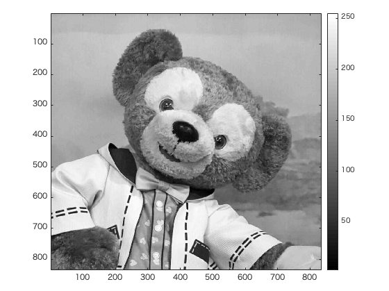
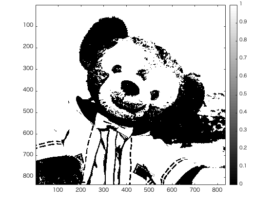
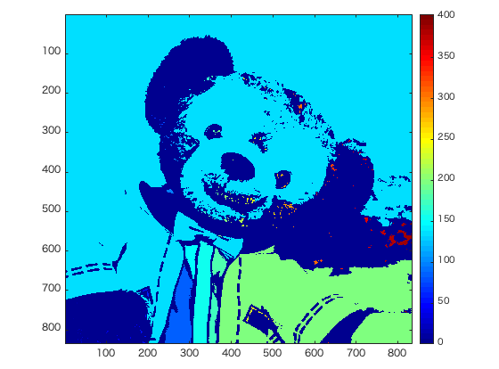

#課題8レポート
画像「duffy」を原画像とする。この画像は縦835画素、横835画素による正方形のディジタルカラー画像である。  

ORG = imread('duffy.jpg'); % 画像の読み込み  
ORG = rgb2gray(ORG); % 白黒濃淡画像に変換  

によって、原画像を読み込み、カラー画像を白黒濃淡画像へ変換し、表示した結果を図1に示す。  

  
図1 変換した原画像  

IMG = ORG > 128; % 閾値128で二値化

により、しきい値を128として原画像を2値画像に変換したものを図2に示す。

  
図2 しきい値128で二値化

また、  
IMG = bwlabeln(IMG);  

により、画像にラベリングを行なったものを図3に示す。  

  
図3 ラベリングした画像  

図3より、2値化された画像の、「1」の部分が色付けされていることがわかる。