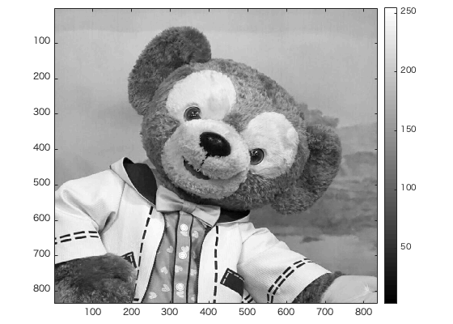
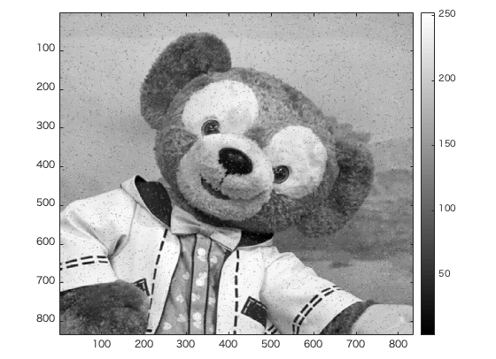
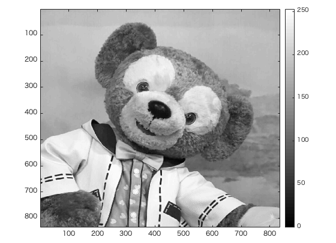
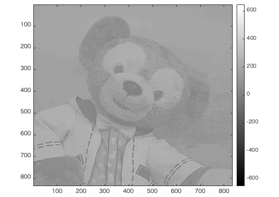

#課題9レポート

画像「duffy」を原画像とする。この画像は縦835画素、横835画素による正方形のディジタルカラー画像である。  

ORG = imread('duffy.jpg'); % 画像の読み込み  
ORG = rgb2gray(ORG); % 白黒濃淡画像に変換  

によって、原画像を読み込み、カラー画像を白黒濃淡画像へ変換し、表示した結果を図1に示す。  

  
図1 変換した原画像  

ORG = imnoise(ORG,'salt & pepper',0.02); % ノイズ添付

により、図1の画像にノイズを添付したものを図2に示す。

  
図2 ノイズを添付した画像  

また、  

IMG = filter2(fspecial('average',3),ORG); % 平滑化フィルタで雑音除去

により、図2の画像を平滑化フィルタを用いて雑音除去したものを図3に示す。

  
図3 平滑化フィルタによる雑音除去  

また、  

IMG = medfilt2(ORG,[3 3]); % メディアンフィルタで雑音除去

により、図2の画像をメディアンフィルタを用いて雑音除去したものを図4に示す。

  
図4 メディアンフィルタによる雑音除去  

さらに、

f=[0,-1,0;-1,5,-1;0,-1,0]; % フィルタの設計  
IMG = filter2(f,IMG,'same'); % フィルタの適用

によりフィルタを設計し、それを適用した画像を図5に示す。

  
図5 設計したフィルタの適用  

図３と図4を比較すると、図4の方がより綺麗に雑音を除去できていることがわかる。